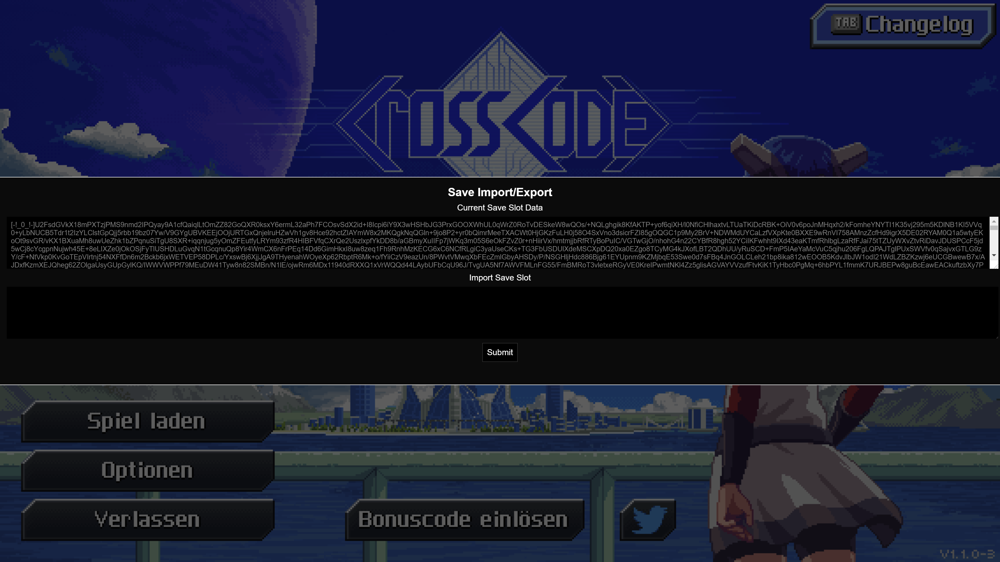
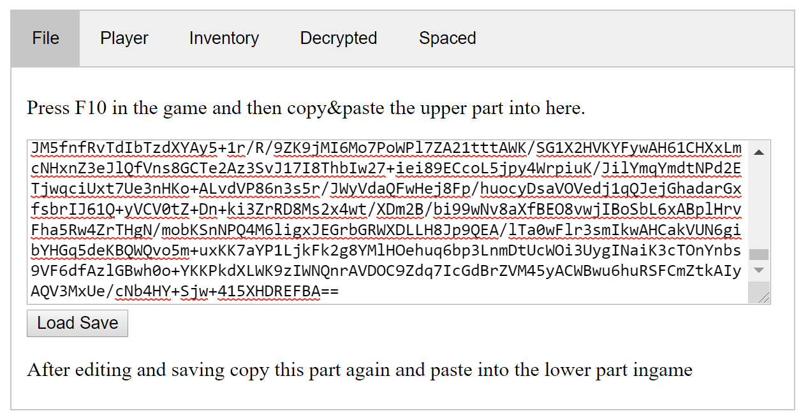
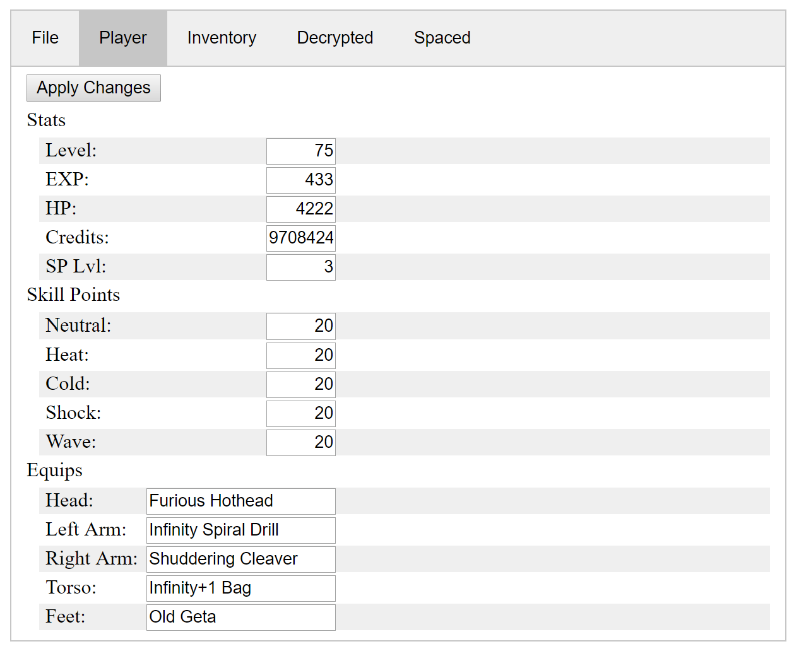
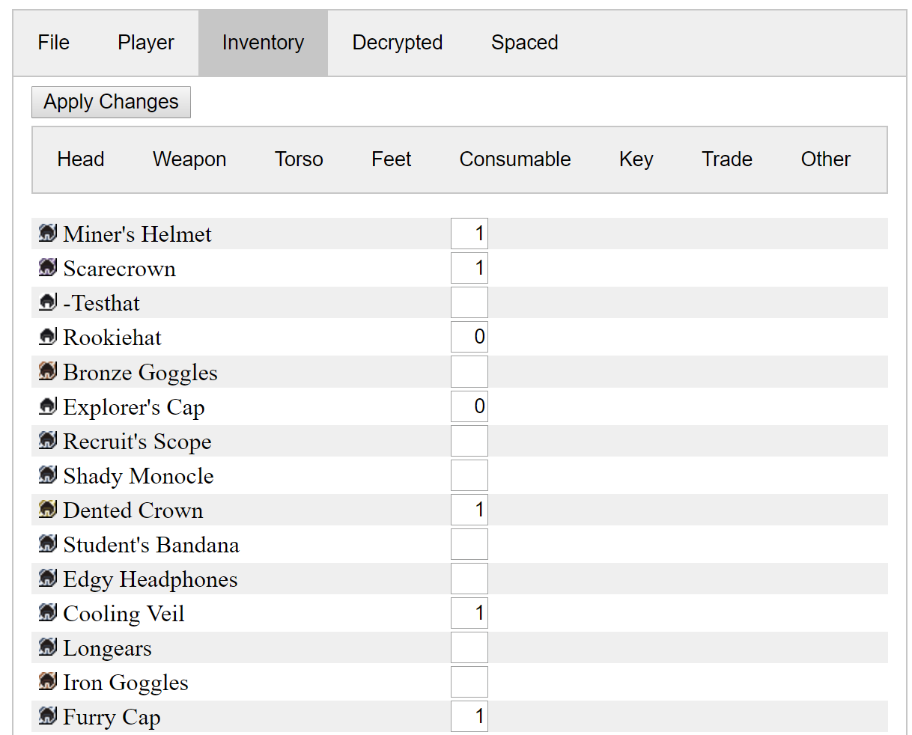

# CCSaveEdit

CCSaveEdit allows you to edit savegames from the Game CrossCode

We are not affiliated with or endorsed by radical fish games

Download repo as zip and extract.

Open `index.html` in your favorite browser.

Run the game and hit F10

Copy the upper part into your clipboard (CTRL+C)

Parte it into the box in the browser

## Player

## Inventory

After changing what you need hit Apply Changes in the top.

Go back to the first tab "File" and copy the text again into your clipboard.

Go back to the game and paste it into the lower part.

If import was successfull you will find a new save game at the very end under "Load Game"
